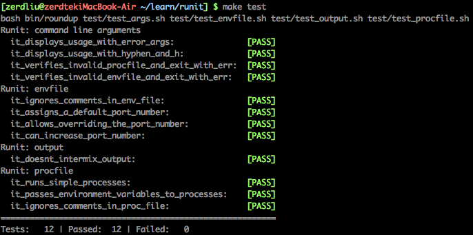
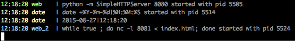

# runit

> 这是一道Shell Good Coder考试题

`runit`是一个应用（application）启动管理工具。通过`Procfile`文件启动相应的进程。

## 1 试题描述

### 1.1 Procfile


`Procfile` 包含进程名字和启动进程的命令，用`:`分隔。如:


```
web: python -m SimpleHTTPServer $PORT
date: date $DATE_FORMAT
web_2: while true ; do nc -l $PORT < index.html
```


* 进程名字可以包含：字母, 数字, 下划线
* `Procfile`中不可以写后台命令
* `runit`将这些命令运行在后台
* `runit`默认使用当前路径下的`Procfile`文件
* 如果多次使用`$PORT`变量，则值递增。如第一个`$PORT`的值是`8080`,则第二个`$PORT`的值为`8081`,如果不在`.env`中设置`$PORT`变量的值，则自动设置默认值为`8080`


### 1.2 环境变量


如果当前目录下存在`.env`文件，则从其中读取环境变量。这个文件由 键/值对 构成。如:


```
PORT=8080
DATE_FORMAT='+%Y-%m-%d|%H:%M:%S'
```


### 1.3 程序执行

* `runit` 启动Procfile中的所有进程
* `runit -f procfile -e env_file`
* `runit -c` 检查Procfile, env_file文件格式的正确性
* `runit -h` 打印帮助

### 1.4 其他要求

* `Procfile`和`.env`文件中可存在`#`注释
* usage内容第一行如下, 其余内容自由发挥

```
Usage: runit [-c] [-f procfile|Procfile] [-e envfile|.env]
```

* 日志打印到屏幕，格式如下，不同的进程的日志输出不同的颜色(web, date, web_2分别是不同的颜色)


```
11:39:45 web    | python -m SimpleHTTPServer 8080 started with pid 781
11:39:45 date   | date +%Y-%m-%d|%H:%M:%S started with pid 790
11:39:45 web_2  | nc -l 8081 < index.html started with pid 801
```


* `runit`按照`Procfile`的描述启动进程，例如web就是启动一个前台进程（非后台进程或daemon）
* `runit`可以接收SIGINT和SIGTERM信号，杀掉已启动的进程。确保`runit`在子进程运行结束后才退出。(如果进程可瞬间完成或是后台进程，则这个功能不起作用)
* 除`grep`外不允许使用其他外部命令，如：`sed, awk, ps, bc`
* 遵循[shell编程规范 附：https://www.chromium.org/chromium-os/shell-style-guidelines]

## 2 参考和帮助(hints)

* ["Colorizing" Scripts](http://www.tldp.org/LDP/abs/html/colorizing.html#AEN20327)
* [Parameter Substitution](http://www.tldp.org/LDP/abs/html/refcards.html#AEN22728)
* [String Operations](http://www.tldp.org/LDP/abs/html/refcards.html#AEN22828)
* [wait](http://www.tldp.org/LDP/abs/html/x9644.html#EX39)
* [getopts](http://wiki.bash-hackers.org/howto/getopts_tutorial)
* [trap](http://www.tldp.org/LDP/abs/html/debugging.html#EX76)
* [POSIX Character Classes](http://www.tldp.org/LDP/abs/html/x17129.html)
* [printf](http://www.tldp.org/LDP/abs/html/internal.html#EX47)
* 列出所有builtin: `help`。验证一个命令是否是builtin: `type -a <command>`
* 将一个string作为代码执行:`bash -c "${command}"`


## 3 如何做题

```

## 0.1. 安装git

## 1. 获取代码

## 2. 编写代码
vim runit

## 3. 运行测试，确保所有测试用例通过
make test
```


```
## 4. 运行一个典型的Procfile
make run
```




## 4. 如何做code review

1. 跑过测试用例（必要条件）

```
make test
```

2. 确认程序启动后的行为

```
make run
## 程序屏幕输出及颜色
## Ctrl + C 之后进程是否被干净的杀掉
```


3. 阅读代码

```
## 代码风格
## 命名准确性
## 改进性建议（更好的写法，潜在的bug和风险）
```

